# Unity URP Pixel Perfect Visibility/Selection

## Overview
This project implements a Universal Render Pipeline (URP) render target-based approach for pixel-perfect object visibility detection and selection of GameObjects.

The implementation is as modern of an approach as possible in URP:
- Unity 2022.2+
- URP 14+ with custom renderer asset and replacement shaders
- Burst compiled jobs
- Native containers
- Async GPU reads
- No-domain reload safe
- Supports `2^16` unique renderers, though due to current limitations in URP batching each *non-culled* (frustum or Umbra) renderer has a draw call cost.

This package is completely free for use in commercial projects (MIT) and can be embedded in Asset Store assets.

 

## Use Cases

### _How do I tell what GameObject is under my mouse cursor?_

Initially this seems like a straightforward problem to solve with screen-relative physics collider/raycasts. Unfortunately such an approach falls apart quickly when geometry is partially occluded. To improve accuracy, drastic increases in raycast density are required and the problem becomes worse the more objects there are to detect.

A render-target based approach has none of these limitations:

`PixelPerfectSelectionCamera.main.GetRendererAtScreenPosition(Input.mousePosition.x, Input.mousePosition.y)`:

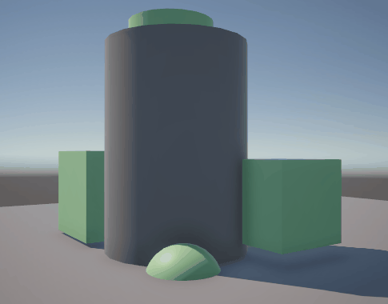

 

### _How do I tell if a GameObject is visible on screen?_

This also seems like a straightforward problem to solve:
- Use `Renderer.isVisible`! Nope, this property isn't camera specific and only indicates that the renderer was in a camera frustum -- meaning that the renderer can still be fully occluded by other geometry.
- Use collider/raycasts from the point of view of the screen. Depending on the game, this technique can work passably, but unfortunately it will always fall apart when an object is partially occluded by other geometry that would block the cast. It also requires that the objects all have colliders on them, which might not be wanted.

With the render-target approach:

`PixelPerfectSelectionCamera.main.IsVisible(myRenderer)`:

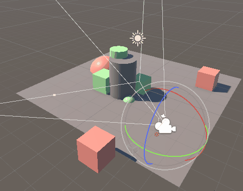

 

## Getting Started

### Installation

1. Download and copy the `Assets/PixelPerfectVisibility` folder into any location in your project.

2. Find your URP configuration assets. For example:
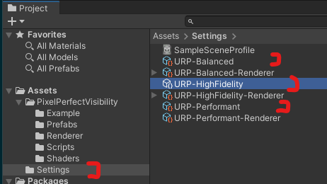

 

3. Add the `PixelPerfectVisibilityRenderer` asset to each of the URP configuration assets' renderer list in index 1 (this can be changed, but for simplicity make it index 1).
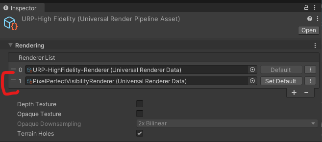

 

4. Add a `PixelPerfectVisibility` layer to project settings. **NOTE**: The layer index can be changed, but it requires modifying a few assets in the package. Those are detailed in 'Implementation Details'.
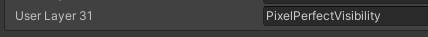

5. If your project has more layers than the default project, you will need to add them to the custom renderer. See 'Adding Opaque Layers'.

 

### Scene Setup

1. Add the `PixelPerfectVisibilityCamera` prefab as a child of your main camera. **NOTE**: This isn't a core requirement, for instance the prefab doesn't need to be a child, but it simplifies the setup.
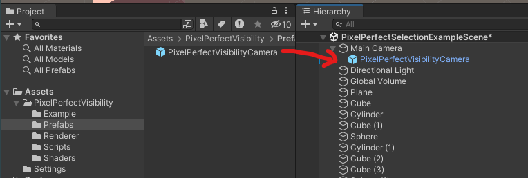

2. Add the `PixelPerfectVisibilityRenderer` to your GameObject.
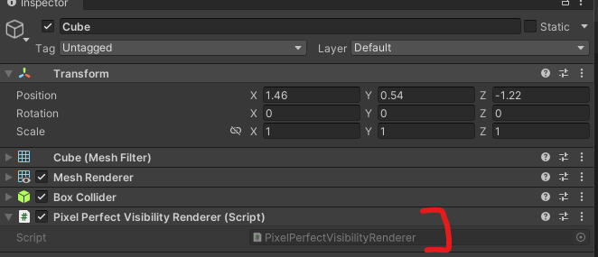

3. Done.

See the `PixelPerfectVisibility/Example` folder for examples of using the API.

 

### Configuration Options

There isn't much to configure currently. Here is what is available:
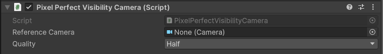

* `Reference Camera` - If you don't make the `PixelPerfectVisibilityCamera` prefab a child of your camera, manually drag the camera you want to use into this field.
* `Quality` - Controls the resolution of the render target in relation to the size of the reference camera output. Options are full/half/quarter -- pick the least resolution possible that provides good gameplay results.

 

### Adding Opaque Layers

If you need to add new layers that have opaque objects that can block visibility, you will need to update the `PixelPerfectVisibilityRenderer` renderer config asset.

1. You've added a new opaque layer:

   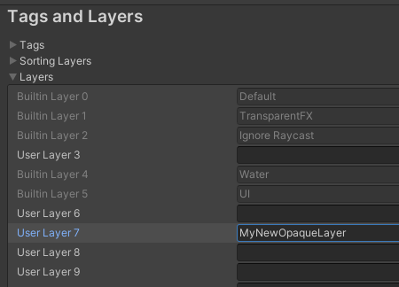
2. Ensure that the `Render Regular Opaque` phase in the `PixelPerfectVisibilityRenderer` asset has your layer checkmarked:

   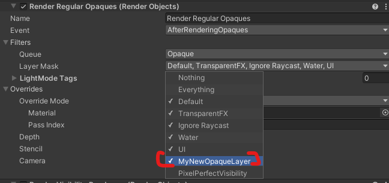

 

### Changing PixelPerfectVisibility Layer

If the `PixelPerfectVisibility` layer isn't in layer 31, the renderer must be updated.

First make sure that `Render Regular Opaques` does not have this layer selected anymore:
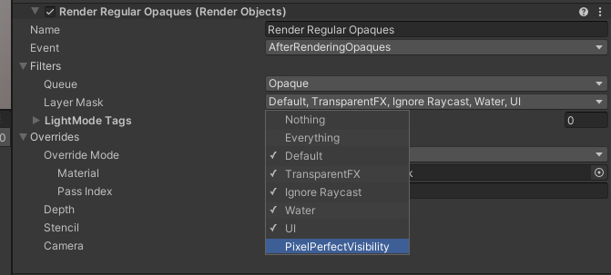

Then make sure that 'Render Visibility Renderers` only has that layer selected:
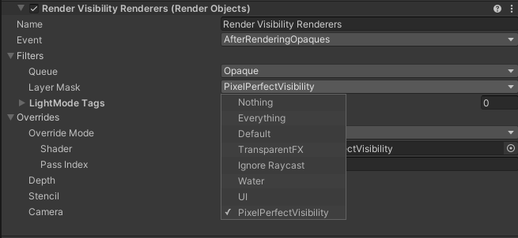

 

## Implementation Details

### **Render Process**
At its core, the implementation relies on usage of a [`Universal Renderer`](https://docs.unity3d.com/Packages/com.unity.render-pipelines.universal@14.0/manual/urp-universal-renderer.html) to render the scene into a special render target.

Some notes:
* The asset does not render anything by default (the `Opaque Layer Mask` and `Transparent Layer Mask`) since it relies on replacement materials/shaders.
* `Render Regular Opaques` is a [`Render Objects`](https://docs.unity3d.com/Packages/com.unity.render-pipelines.universal@14.0/manual/renderer-features/renderer-feature-render-objects.html) pass utilizing a replacement material to render scene opaques that aren't visibility tested as pure black into the render texture. This is considered 'object id' 0.
* `Render Visibility Renderers` is another `Render Objects` pass that utilizes a replacement shader for rendering and that writes out each renderer's "object id" as a color. This feature was added in URP 14, but came with the caveat that _'When rendering an object, Unity replaces the material assigned to it with this shader. This maintains all material properties and allows the override shader to access these properties. This is currently not SRPBatcher compatible and less performant.'_ 

  The TLDR is that each visibility renderer requires one draw call each if they are not frustum culled. Could be worse. 

  A replacement material couldn't be used for this phase because each renderer needs its own unique `_PixelPerfectSelectionObjectId` shader material parameter. The Unity standard renderer was batchable because `MaterialPropertyBlock` could be used, but URP does not support that feature so :shrug:.
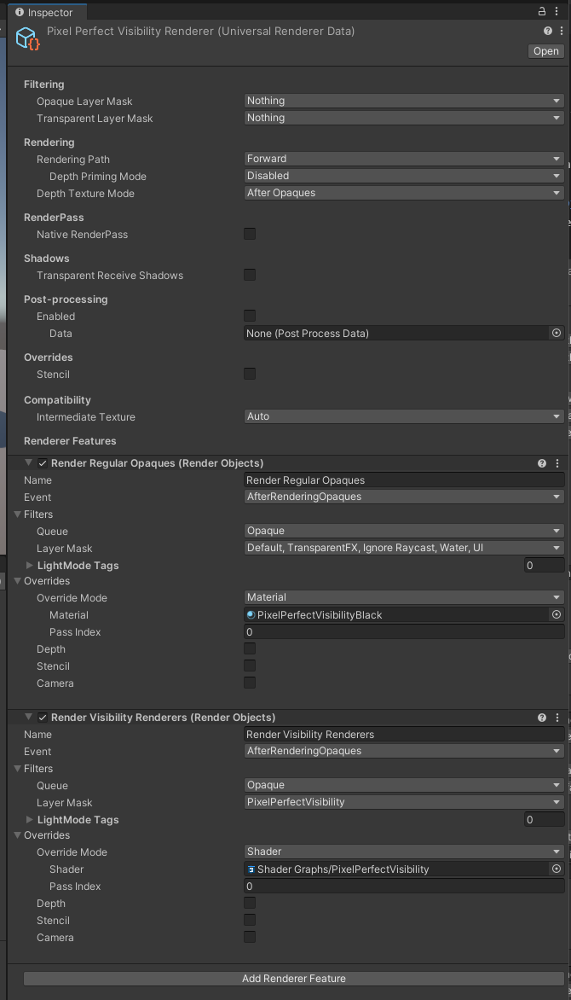

 

The result of this configuration is a render target that has visibility tested objects rendered in a unique color, representing their "object id".

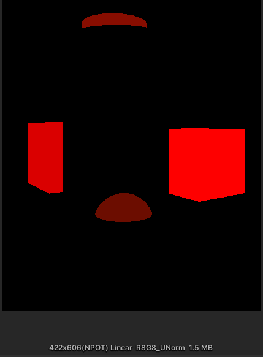

The render target is then async copied from the GPU into a `NativeArray<byte>` via the [`AsyncGPUReadback.RequestIntoNativeArray`](https://docs.unity3d.com/ScriptReference/Rendering.AsyncGPUReadback.RequestIntoNativeArray.html), and the pixels analyzed for their "object id" by a Burst compiled job. The result of that analysis is used to determine object visibility and provide selection query support.

The pixel counting job:

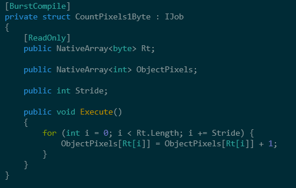

It is possible that this job could be optimized into a compute shader, but it's unclear to me if all platforms could support this. For instance, Metal does not allow atomic operations on textures.

